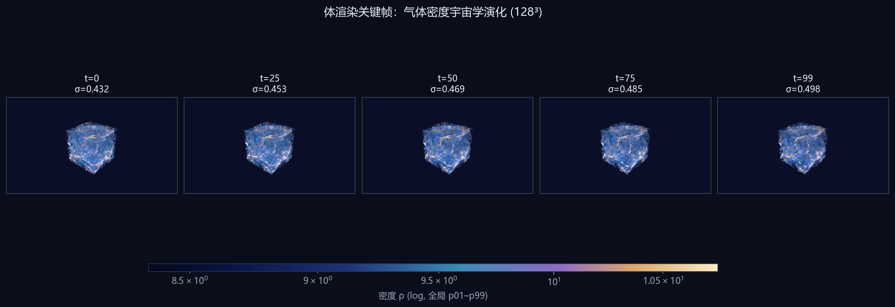
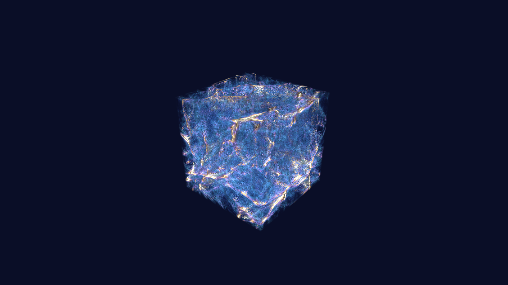
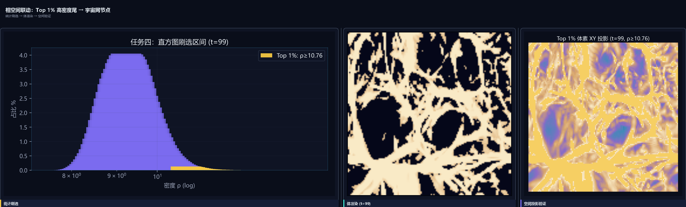
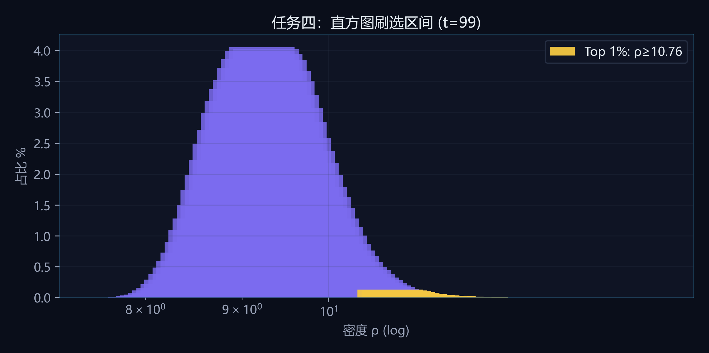
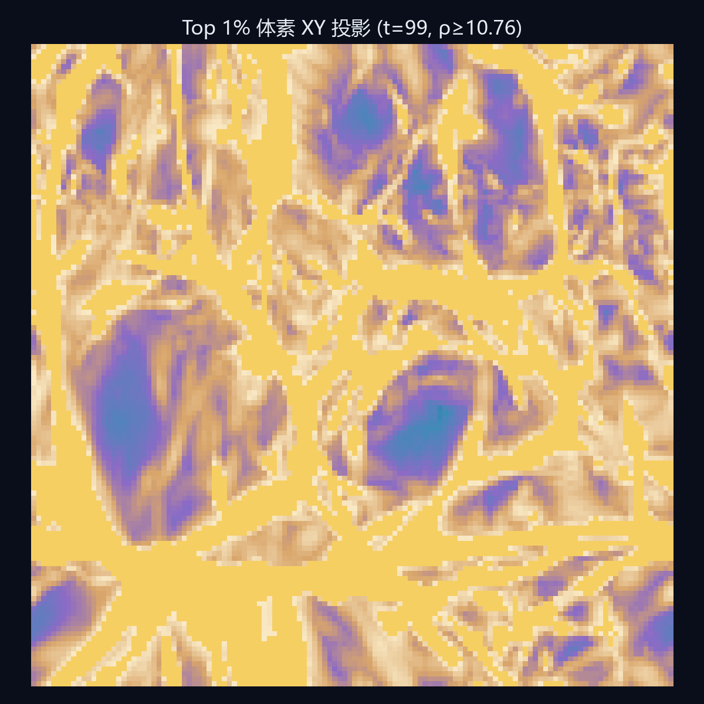
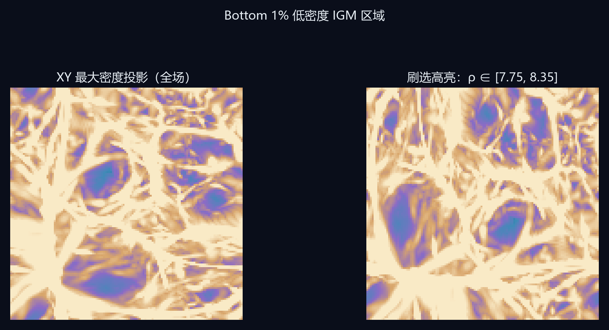

# 任务一：体数据渲染与密度演化

## 方法
- **数据**：Nyx 官方 128³ 气体密度，100 时间步，小端 float32，存储顺序 z→y→x（`index = z + 128y + 128²x`）。
- **渲染**：基于 vtk.js 的 GPU 光线投射体渲染；传递函数采用宇宙学预设 `cosmic`——低密度空洞区近透明，纤维结构紫青，高密度节点金黄；双光源（主光 + 冷色补光），交互模式采样距离 2.2，可选高质量模式采样 1.0 并开启 Phong 着色。
- **展示**：选取 t=0/25/50/75/99 五帧，统一色标与相机，便于对比演化。

## 观察
- **t=0**：整体呈均匀雾状，filament 对比度弱，尚处于涨落初生的“平滑”阶段。
- **t=25–50**：丝状结构逐渐连通，低密度 void 区域扩大。
- **t=99**：宇宙网状拓扑清晰，高密度脊线与节点在体渲染中形成亮带，与统计上的右尾增厚一致。

## 数据佐证
- t=0: mean=9.4854, σ=0.4318, p99=10.7255, max=13.8433
- t=25: mean=9.4369, σ=0.4525, p99=10.7402, max=14.0505
- t=50: mean=9.3954, σ=0.4693, p99=10.7507, max=14.3269
- t=75: mean=9.3556, σ=0.4847, p99=10.7547, max=14.3541
- t=99: mean=9.3187, σ=0.4983, p99=10.7601, max=14.4494

## 配图（≤5）

---

# 任务二：宇宙密度演化规律归纳

## 结构形成（团块化）
- 在 100 步引力团块化过程中，**密度分位跨度 p99−p01** 由 2.098 增至 2.414（+15.1%），说明高低密度区域分化加剧。
- **标准差 σ** 由 0.4318 升至 0.4983，全域涨落幅度持续扩大，符合“均匀 IGM → 纤维/节点”结构形成图像。

## 星系际介质（IGM）
- 密度直方图主峰始终位于中低密区，**≥p99 的体素体积占比**约 1.00%（t=99），即绝大部分体积仍为稀疏 IGM，仅少量重子汇入致密通道构成宇宙网可见结构。

## 可视化应用价值
- **体渲染**提供全局形态直觉，识别 filaments 与 void 的空间布局；
- **100 步 log 直方图**量化分布漂移，避免“只看漂亮图”的主观判断；
- **相空间刷选**将高密度尾与空间节点一一对应，形成“假设—统计—空间”闭环，支撑宇宙学数据探索。

## 可检验结论（三条）
1. 涨落增强：σ(t) 单调上升趋势（见图 task2_evolution_story）。
2. 两极分化：偏度维持右偏且尾翼抬升，低密度空洞与高密度节点共存。
3. 宇宙网对应：Top 1% 空间投影呈丝状聚集，与体渲染亮脊位置一致（任务四验证）。

## 配图

---

# 任务三：时序密度对数直方图统计

## 方法
- 对 **全部 100 个时间步** 的气体密度做 **log 等距分箱**（128 bins），边界 `[7.7533, 14.5231]`（全域 min/max）。
- 分箱中心 ρᵢ = √(edgeᵢ · edgeᵢ₊₁)，直方图为归一化频数 Σcount/N。
- 同步预计算每步 mean、σ、p01/p50/p99、偏度 skew，用于时序曲线（`tools/python/precompute.py` → `timeline.json`）。

## 演化规律
- **团块化**：σ 由 0.4318 → 0.4983，物质分布由相对均匀转向强烈聚敛。
- **两极分化**：偏度 0.7162 → 0.7183，右尾持续增厚；代表步直方图叠加显示主峰略移、尾部抬升，对应“void + 致密节点”。
- **分位跨度**：p99−p01 扩大，高密度尾体积占比稳定在 ~1% 量级，但空间上对应可见宇宙网。

## 与赛题描述的对照
赛题指出早期密度集中于均值附近、后期出现空洞与峰值两极分化——本工作用 **100 步完整直方图序列** 而非单帧切片证明该趋势，并给出可复现的数值曲线。

## 配图

---

# 任务四：相空间交互刷选可视分析

## 系统功能
- **统计视图**：log 密度直方图，支持拖拽框选密度区间；快捷 **Top 1%**（ρ≥p99=10.7601）与 **Bottom 1%**（ρ≤p01=8.3458）。
- **空间视图**：vtk.js 体渲染对刷选区间体素做传递函数高亮；Canvas 2D **最大密度投影** 以金色标出刷选体素；可选 3D 点云（≤12000 点，Web Worker 后台扫描）。
- **性能**：刷选扫描在 Worker 线程；VTK 按需加载；相邻时间步 idle 预取。

## 验证：统计 → 空间
- **Top 1%**：直方图右尾刷选后，XY 投影显示丝状/节点状聚集（非随机散点），与 t=99 体渲染中的亮脊一致 → **高密度尾对应宇宙网致密结构**。
- **Bottom 1%**：刷选低密度左尾，投影显示广袤稀疏区域，对应 IGM 主体。

## 双向关联
- **统计→空间**：框选 [ρ_min, ρ_max] 定位满足条件的体素集合；
- **空间→统计**：在体渲染/投影中识别 filament 后，可在直方图上标出对应密度带（见代表步直方图标注）。

## 配图

