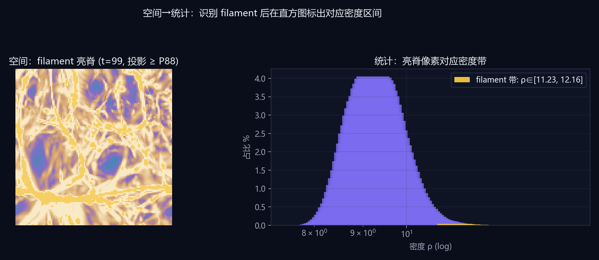

# 任务一：体数据渲染与密度演化

## 宇宙网诞生（01–02）
- 本任务展示 Nyx **128³ 重子气体密度**在 100 步引力演化中，由微涨落向 **void—filament—node** 宇宙网分化的可见过程（仅气体密度，非暗物质）。
- 叙事对应「宇宙网诞生记」：**01 引言**给出全局形态直觉，**02 演化全景**用五帧体渲染对比结构生长。

## 方法
- **数据**：Nyx 官方 128³ 气体密度，100 时间步（t=0…99），小端 float32，存储顺序 z→y→x（`index = z + 128y + 128²x`）。
- **渲染**：基于 vtk.js 的 GPU 光线投射体渲染；传递函数采用宇宙学预设 `cosmic`（log 域、全局 p01–p99）；展板质量采样 + Phong 着色；五帧由 Playwright 截取。
- **展示**：选取 t=0/25/50/75/99 五帧，统一色标与相机，便于对比演化。

## 观察（三阶段）
- **t=0–29 线性期**：整体呈均匀雾状，filament 对比度弱。
- **t=30–69 非线性期**：丝状结构逐渐连通，void 区域扩大。
- **t=70–99 宇宙网期**：高密度脊线与节点形成亮带，与统计右尾增厚一致。

## 数据佐证
- t=0: mean=9.4854, σ=0.4318, p99=10.7255, max=13.8433
- t=25: mean=9.4369, σ=0.4525, p99=10.7402, max=14.0505
- t=50: mean=9.3954, σ=0.4693, p99=10.7507, max=14.3269
- t=75: mean=9.3556, σ=0.4847, p99=10.7547, max=14.3541
- t=99: mean=9.3187, σ=0.4983, p99=10.7601, max=14.4494

## 工具与环境
- **本任务**：vtk.js 体渲染 + cosmic 传递函数；静态条带与单帧图由 `generate_figures.py` 排版，体渲染帧由 Playwright 生成。
- **通用栈**：Vite + React + TypeScript；**vtk.js** 体渲染；**D3.js** 统计图表；Python（`tools/python/precompute.py`、`generate_figures.py`、`viz_style.py`）预计算与 matplotlib 配图；**Playwright**（`tools/node/capture_volumes.mjs`）1920×1080 体渲染截图；`export_report.py` / `export_docx.py` 报告导出；`npm run submission-pack` 一键交付。

## 配图（≤5）

---

# 任务二：宇宙密度演化规律归纳

## 数据与物理背景
- 本数据集来自 **Nyx** 宇宙学模拟：基于 **AMReX** 自适应网格框架的引力流体计算，追踪高红移宇宙中**星系际介质（IGM）**气体密度随时间的演化。
- 128³ 子体积记录的是**重子气体密度**（非暗物质）；100 个时间步对应引力不稳定下，由近乎均匀微涨落向 **void—filament—node** 宇宙网拓扑分化的典型过程。
- IGM 密度动态范围大、分布强右偏，故本报告在 log 域统计与可视化；绝大部分体积仍为稀疏 IGM，肉眼可见的亮脊/节点对应极少数高密度尾。

## 结构形成（团块化）
- 在 100 步引力团块化过程中，**密度分位跨度 p99−p01** 由 2.098 增至 2.414（+15.1%），说明高低密度区域分化加剧。
- **标准差 σ** 由 0.4318 升至 0.4983，全域涨落幅度持续扩大，符合“均匀 IGM → 纤维/节点”结构形成图像。

## 星系际介质（IGM）
- 密度直方图主峰始终位于中低密区，**≥p99 的体素体积占比**约 1.00%（t=99），即绝大部分体积仍为稀疏 IGM，仅少量重子汇入致密通道构成宇宙网可见结构。

## 可视化应用价值
- **体渲染**提供全局形态直觉，识别 filaments 与 void 的空间布局；
- **100 步 log 直方图**量化分布漂移，避免“只看漂亮图”的主观判断；
- **相空间刷选**将高密度尾与空间节点一一对应，形成“假设—统计—空间”闭环，支撑宇宙学数据探索。

## 科学发现摘要（05）
1. **引力团块化**：σ 由 0.4318 升至 0.4983（+15.4%）；p99−p01 由 2.098 增至 2.414（+15.1%）。
2. **两极分化**：偏度 0.7162→0.7183，void 与致密节点并存。
3. **少数致密承载结构**：≥p99 体素体积占比约 1.00%，可见宇宙网由高密度尾承载。
4. **统计—空间一致**：Top 1% 投影呈丝状，与体渲染亮脊一致（任务四验证）。

## 工具与环境
- **本任务**：`precompute.py` 百步全域统计；`generate_figures.py` 绘制 task2 四联演化曲线（matplotlib + cosmic 主题）。
- **通用栈**：Vite + React + TypeScript；**vtk.js** 体渲染；**D3.js** 统计图表；Python（`tools/python/precompute.py`、`generate_figures.py`、`viz_style.py`）预计算与 matplotlib 配图；**Playwright**（`tools/node/capture_volumes.mjs`）1920×1080 体渲染截图；`export_report.py` / `export_docx.py` 报告导出；`npm run submission-pack` 一键交付。

## 配图

---

# 任务三：时序密度对数直方图统计

## 定量分析：密度两极化（03）
- 对应「宇宙网诞生记」第三节：用 **100 步完整 log 直方图** 证明分布由集中于均值附近，转向 void 与峰值两极分化（非单帧主观判断）。

## 方法
- 对 **全部 100 个时间步** 的气体密度做 **log 等距分箱**（128 bins），边界 `[7.7533, 14.5231]`（全域 min/max）。
- 分箱中心 ρᵢ = √(edgeᵢ · edgeᵢ₊₁)，直方图为归一化频数 Σcount/N。
- 同步预计算每步 mean、σ、p01/p50/p99、偏度 skew，用于时序曲线（`tools/python/precompute.py` → `timeline.json`）。

## 演化规律
- **团块化**：σ 由 0.4318 → 0.4983（+15.4%），物质由相对均匀转向聚敛。
- **两极分化**：偏度 0.7162 → 0.7183；p99−p01 由 2.098 → 2.414（+15.1%）。
- **高密度尾**：≥p99 体积占比约 1.00%，空间上对应 filament/节点。

## 与赛题描述的对照
赛题指出早期密度集中于均值附近、后期出现空洞与峰值两极分化——本工作用 **100 步完整直方图序列** 而非单帧切片证明该趋势，并给出可复现的数值曲线。

## 工具与环境
- **本任务**：`precompute.py` 生成 128-bin log 直方图与 `timeline.json`；静态曲线/叠加图由 `generate_figures.py` 输出；交互页 **D3.js** 直方图与时序图与成果页一致。
- **通用栈**：Vite + React + TypeScript；**vtk.js** 体渲染；**D3.js** 统计图表；Python（`tools/python/precompute.py`、`generate_figures.py`、`viz_style.py`）预计算与 matplotlib 配图；**Playwright**（`tools/node/capture_volumes.mjs`）1920×1080 体渲染截图；`export_report.py` / `export_docx.py` 报告导出；`npm run submission-pack` 一键交付。

## 配图

---

# 任务四：相空间交互刷选可视分析

## 统计↔空间验证（04）
- 交互页 v2 为三栏仪表盘：左统计、中体渲染常驻、右刷选；预设 **Top 1%**、**90–99% 纤维**（ρ∈[9.96,10.76]）、**Bottom 1%**，与中栏高亮联动。

## 系统功能
- **统计视图**：log 密度直方图，支持拖拽框选；快捷 **Top 1%**（ρ≥p99=10.7601）、**纤维 90–99%**、**Bottom 1%**（ρ≤p01=8.3458）。
- **空间视图**：vtk.js 体渲染刷选高亮；Canvas 2D **最大密度投影** 金色标出刷选体素；Web Worker 扫描。
- **性能**：刷选不阻塞渲染；相邻时间步 idle 预取。

## 验证：统计 → 空间
- **Top 1%**：直方图右尾刷选后，XY 投影显示丝状/节点状聚集（非随机散点），与 t=99 体渲染中的亮脊一致 → **高密度尾对应宇宙网致密结构**。
- **Bottom 1%**：刷选低密度左尾，投影显示广袤稀疏区域，对应 IGM 主体。

## 验证：空间 → 统计
- 在 t=99 **XY 最大密度投影**上识别 **filament 亮脊**（投影值 ≥ P88 的像素，金色叠加）。
- 汇总这些亮脊像素的密度，得到对应区间 **ρ∈[11.23, 12.16]**（位于 p75–p99 右尾，与 Top 1% 刷选区间一致）。
- 在 log 直方图上以金色标注该密度带 → **空间结构可反查统计位置**，与 `/app.html` 中「先在投影/体渲染定位 filament，再在直方图标密度带」的交互路径一致。

## 双向关联
- **统计→空间**：框选 [ρ_min, ρ_max] 定位满足条件的体素集合（见 Top/Bottom 1% 三联图）。
- **空间→统计**：在投影中识别 filament 亮脊后，反推密度带 ρ∈[11.23, 12.16] 并在直方图高亮（见 `task4_spatial_to_stats.png`，由 `spatial_to_stats.py` 与 `generate_figures.py` 可复现）。

## 工具与环境
- **本任务**：**D3.js** 直方图框选 + **vtk.js** 刷选高亮 + Canvas 2D 最大密度投影（与体渲染同色标）；刷选体素扫描在 **Web Worker**；静态三联图与空间→统计配图由 `generate_figures.py` / `projection_render.py` / `spatial_to_stats.py` 生成。
- **通用栈**：Vite + React + TypeScript；**vtk.js** 体渲染；**D3.js** 统计图表；Python（`tools/python/precompute.py`、`generate_figures.py`、`viz_style.py`）预计算与 matplotlib 配图；**Playwright**（`tools/node/capture_volumes.mjs`）1920×1080 体渲染截图；`export_report.py` / `export_docx.py` 报告导出；`npm run submission-pack` 一键交付。

## 配图

