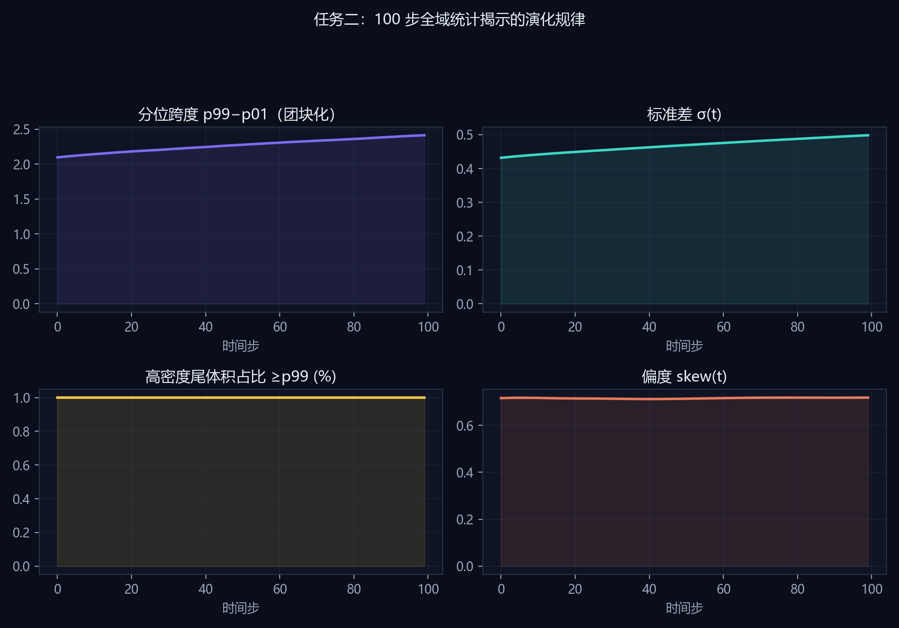
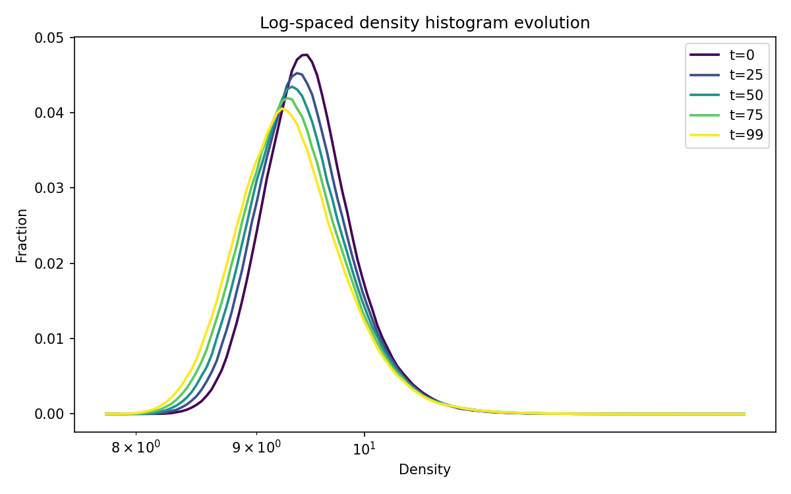
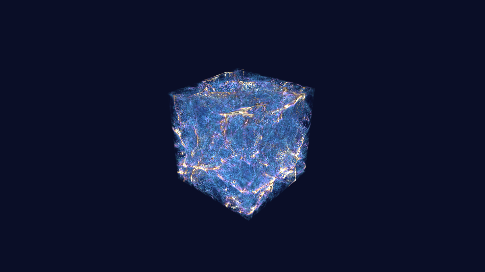
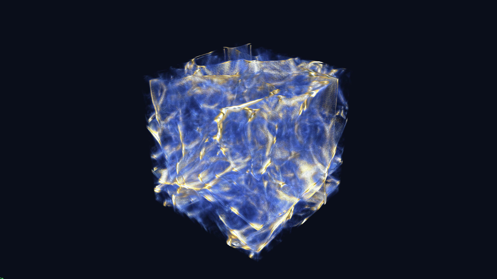

# 任务二：宇宙密度演化规律归纳

## 数据与物理背景
- 本数据集来自 **Nyx** 宇宙学模拟：基于 **AMReX** 自适应网格框架的引力流体计算，追踪高红移宇宙中**星系际介质（IGM）**气体密度随时间的演化。
- 128³ 子体积记录的是**重子气体密度**（非暗物质）；100 个时间步对应引力不稳定下，由近乎均匀微涨落向 **void—filament—node** 宇宙网拓扑分化的典型过程。
- IGM 密度动态范围大、分布强右偏，故本报告在 log 域统计与可视化；绝大部分体积仍为稀疏 IGM，肉眼可见的亮脊/节点对应极少数高密度尾。

## 结构形成（团块化）
- 在 100 步引力团块化过程中，**密度分位跨度 p99−p01** 由 2.098 增至 2.414（+15.1%），说明高低密度区域分化加剧。
- **标准差 σ** 由 0.4318 升至 0.4983，全域涨落幅度持续扩大，符合“均匀 IGM → 纤维/节点”结构形成图像。

## 星系际介质（IGM）
- 密度直方图主峰始终位于中低密区，**≥p99 的体素体积占比**约 1.00%（t=99），即绝大部分体积仍为稀疏 IGM，仅少量重子汇入致密通道构成宇宙网可见结构。

## 可视化应用价值
- **体渲染**提供全局形态直觉，识别 filaments 与 void 的空间布局；
- **100 步 log 直方图**量化分布漂移，避免“只看漂亮图”的主观判断；
- **相空间刷选**将高密度尾与空间节点一一对应，形成“假设—统计—空间”闭环，支撑宇宙学数据探索。

## 可检验结论（三条）
1. 涨落增强：σ(t) 单调上升趋势（见图 task2_evolution_story）。
2. 两极分化：偏度维持右偏且尾翼抬升，低密度空洞与高密度节点共存。
3. 宇宙网对应：Top 1% 空间投影呈丝状聚集，与体渲染亮脊位置一致（任务四验证）。

## 工具与环境
- **本任务**：`precompute.py` 百步全域统计；`generate_figures.py` 绘制 task2 四联演化曲线（matplotlib + cosmic 主题）。
- **通用栈**：Vite + React + TypeScript；**vtk.js** 体渲染；**D3.js** 统计图表；Python（`tools/python/precompute.py`、`generate_figures.py`、`viz_style.py`）预计算与 matplotlib 配图；**Playwright**（`tools/node/capture_volumes.mjs`）1920×1080 体渲染截图；`export_report.py` / `export_docx.py` 报告导出；`npm run submission-pack` 一键交付。

## 配图

