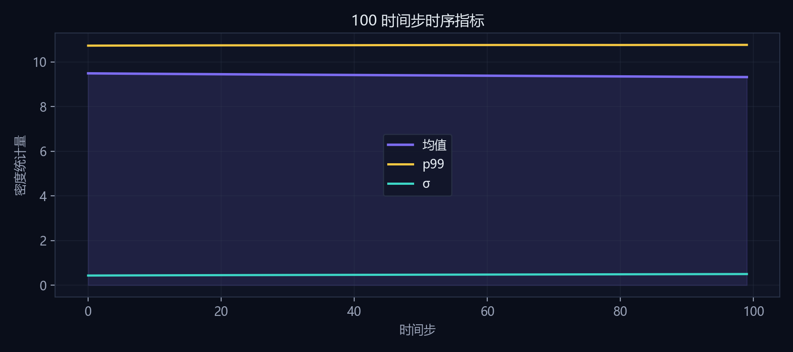
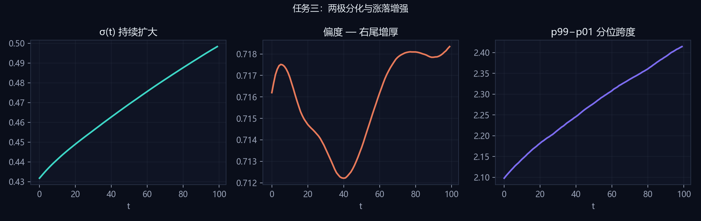
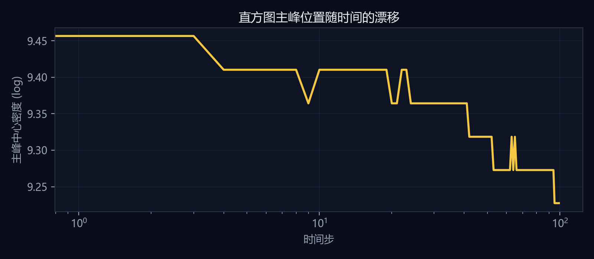

# 任务三：时序密度对数直方图统计

## 方法
- 对 **全部 100 个时间步** 的气体密度做 **log 等距分箱**（128 bins），边界 `[7.7533, 14.5231]`（全域 min/max）。
- 分箱中心 ρᵢ = √(edgeᵢ · edgeᵢ₊₁)，直方图为归一化频数 Σcount/N。
- 同步预计算每步 mean、σ、p01/p50/p99、偏度 skew，用于时序曲线（`scripts/precompute.py` → `timeline.json`）。

## 演化规律
- **团块化**：σ 由 0.4318 → 0.4983，物质分布由相对均匀转向强烈聚敛。
- **两极分化**：偏度 0.7162 → 0.7183，右尾持续增厚；代表步直方图叠加显示主峰略移、尾部抬升，对应“void + 致密节点”。
- **分位跨度**：p99−p01 扩大，高密度尾体积占比稳定在 ~1% 量级，但空间上对应可见宇宙网。

## 与赛题描述的对照
赛题指出早期密度集中于均值附近、后期出现空洞与峰值两极分化——本工作用 **100 步完整直方图序列** 而非单帧切片证明该趋势，并给出可复现的数值曲线。

## 配图

