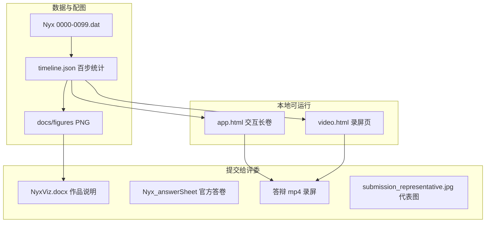

# 00 · 阅读指南

[← 返回主索引](../NyxViz_零基础完全解读.md)

---

## 这份手册是干什么的

你手里有一份很厚的 Word：**[`NyxViz.docx`](../NyxViz.docx)**（作品说明）。里面有很多专业词、图号、表格和数字。  
本手册**不替代** Word，而是：

1. 从**赛题题目**出发，解释「为什么要做这些图」；
2. 把 Word 里每一章、每一图**翻译成白话**；
3. 把**录屏 11 页**和 Word、代码**一一对应**起来；
4. 提供**名词词典**，不懂就查。

如果你「什么都不懂」，按主索引的「推荐阅读顺序」走即可。

---

## 仓库里到底有哪些「成品」



| 类型 | 位置 | 你什么时候用 |
|------|------|--------------|
| 作品说明 Word | `docs/submission/NyxViz.docx` | 上交、答辩前通读 |
| 官方答卷 | `docs/submission/Nyx_answerSheet_filled.docx` | 四题各 ≤800 字简答 |
| 交互网页 | `/app.html` | 本地演示、自己玩 |
| 录屏网页 | `/video.html?record=1&scene=…` | OBS 录答辩视频 |
| 统计真源 | `public/stats/timeline.json` | 所有数字的「标准答案」 |
| 静态配图 | `docs/figures/*.png` | Word 里嵌入的图 |

---

## Word 文档结构（略读版）

`NyxViz.docx` **前半**可能是官方答卷封面（队名、成员、工具清单）——填表用，**本手册略写**。

**正文**从 **§0 系统概览** 开始，是本手册 [04 章](./04-Word正文逐章解读.md) 的主线：

| 章节 | 标题 | 对应赛题 |
|------|------|----------|
| §0 | 系统概览、术语表 | 整体介绍 |
| §1 | 体数据渲染与密度演化 | **任务一** |
| §2 | 宇宙密度演化规律归纳 | **任务二** |
| §3 | 时序密度对数直方图统计 | **任务三** |
| §4 | 相空间交互刷选可视分析 | **任务四** |
| §5 | 综合叙事与科学发现 | 总结 |
| 附录 1–4 | 流程、可视设计、数据、工具 | 方法细节 |
| 附录 5 | 各题验证与敏感度 | 补充图表 |

---

## 三种「看宇宙网」的方式，别混了

这是答辩最容易被问到的点之一。

| 方式 | 是什么 | 传递函数 TF 是否随时间变 |
|------|--------|---------------------------|
| **A. 交互页 / 录屏页体渲染** | 浏览器里 vtk.js 实时渲染 | **不变**（全局 p01–p99 域） |
| **B. 五帧条带图**（图2） | Playwright 截 `capture.html` | **每帧不同**（Evolution Capture Profile） |
| **C. 静态 matplotlib 图** | Python 生成的曲线/直方图 | 不涉及体渲染 |

- **讲形态、讲结构**：A 或 B 都可以，但 B 的条带**不能**用来定量对比「同一密度在不同时间步有多亮」。
- **讲数字、讲统计**：以 `timeline.json` 和 C 类图为准。
- **录屏视频**：用的是 **A**（`video.html`）。

详细对比表见 [04 §0](./04-Word正文逐章解读.md#0-系统概览)。

---

## 录屏与 Word 怎么对应

录屏共 **11 段**，每段一个 URL，旁白 **11 行**（[`VIDEO_NARRATION_TTS.txt`](../../competition/VIDEO_NARRATION_TTS.txt)）。

| 录屏段 | scene | 主要对应 Word |
|--------|-------|---------------|
| 1 | intro | §0 系统概览 A–F |
| 2–3 | task1-tf / task1-morph | §1 任务一 |
| 4–7 | task2-* | §2 任务二 |
| 8 | task3-hist | §3 任务三 |
| 9–10 | task4-* | §4 任务四 |
| 11 | findings | §5.2 四发现卡 |

完整逐页说明见 [06 章](./06-录屏页video完全手册.md)。

---

## 推荐阅读路径

### 路径 A：我只管录屏答辩（最快）

1. [03 叙事逻辑](./03-叙事逻辑与科学结论.md) — 知道要讲什么故事  
2. [06 录屏手册](./06-录屏页video完全手册.md) — 每页指哪里  
3. [10 答辩代码讲解](./10-答辩代码讲解.md) — 评委问实现时怎么答  
4. [09 FAQ](./09-本地复现与答辩清单.md) — 评委常问  

### 路径 B：我要读懂整份 Word

1. [01 竞赛题目](./01-竞赛题目与我们要回答什么.md)  
2. [02 名词词典](./02-专业名词词典.md) — 边读边查  
3. [04 Word 逐章](./04-Word正文逐章解读.md)  

### 路径 C：我要改代码或重跑数据

1. [08 数据与代码管线](./08-数据与代码管线.md)  
2. [07 文档地图](./07-仓库文档地图.md)  

### 路径 D：答辩前补代码讲解（推荐与路径 A 联读）

1. [10 答辩代码讲解](./10-答辩代码讲解.md) — 总索引：四任务文件链 + 全局联动 + 口述稿  
2. [10a](./10a-体渲染与VTK代码.md) · [10b](./10b-直方图与D3代码.md) · [10c](./10c-刷选与Worker代码.md) · [10d](./10d-投影空间与录屏组件代码.md) · [10e](./10e-Python配图代码.md) — **含真实源码摘录**  
3. [08 数据与代码管线](./08-数据与代码管线.md) — 需要改某文件时查表  

---

## 本地怎么打开

在项目根目录（含 `Nyx/` 数据文件夹）：

```powershell
cd F:\commercial\NyxViz
python run.py
```

浏览器会自动打开 `app.html`。录屏页手动访问：

`http://127.0.0.1:5173/video.html?record=1&scene=intro`

详见 [09 章](./09-本地复现与答辩清单.md)。

---

[下一章：01 竞赛题目与我们要回答什么 →](./01-竞赛题目与我们要回答什么.md)
