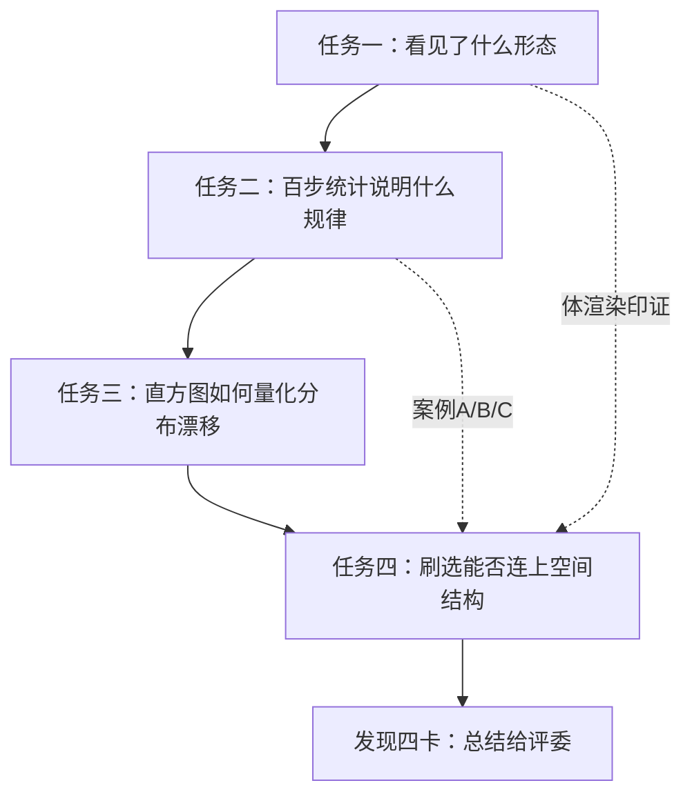

# 03 · 叙事逻辑与科学结论

[← 02 名词词典](./02-专业名词词典.md) · [← 主索引](../NyxViz_零基础完全解读.md)

---

## 一句话故事

**从几乎均匀的气体，到 void—filament—node 宇宙网**——我们用体渲染让人**看见**，用百步统计让人**量化**，用刷选让人**验证**「高密度尾 = 空间里的丝」。

---

## 答辩主线（四题闭环）

| 阶段 | 问题 | 本作品答案（关键词） |
|------|------|----------------------|
| 看见 | 宇宙网长什么样？ | 五帧体渲染：雾 → 丝 → 网（§1） |
| 量化 | 是不是偶然两帧？ | σ **+15.4%**，span **+15.1%** 百步曲线（§2） |
| 分布 | void/尾如何变？ | void p10 **10→24.69%**；p50 下移 + 右尾抬高（§3） |
| 验证 | 统计与空间一致吗？ | Top 1% 刷选呈 **filament**；P88 反查 ρ 区间一致（§4） |
| 收束 | 科学意义？ | 四发现卡 + 质量占比（§5） |

---

## 必须会说的 5 组数字

背下来，答辩几乎够用（均来自 `timeline.json` t=99 vs t=0）：

| # | 数字 | 含义 | 在哪说 |
|---|------|------|--------|
| 1 | **σ +15.4%** | 0.4318 → 0.4983，涨落扩大、团块化 | task2-evolution、§2 |
| 2 | **p99−p01 +15.1%** | 2.098 → 2.414，高低密分化 | 同上 |
| 3 | **void 10% → 24.69%** | 固定 t=0 的 p10 阈值下稀区扩大 | task2-void、§3 |
| 4 | **Top 1%：1% 体积 / ~1.19% 质量** | 少数致密体素承载结构 | task2-cases B、findings 03 |
| 5 | **早停 ~37 ms vs 全网格 ~282 ms** | 刷选性能；高亮仍全场 | task4-validate、§4 |

另备：**离线召回 100%、精确率 27.6%**——不是错误，表示密度分位**比**几何脊线**更宽**（见 [09 FAQ](./09-本地复现与答辩清单.md)）。

---

## 三个「可视化价值」案例（任务二 §2.2）

录屏 **task2-cases** 左栏 A/B/C 与 Word **图9** 对应。

### 案例 A：百步曲线 vs 挑帧叙事

- **陷阱**：只展示 t=0 和 t=99 两帧，可能夸大「突然长成宇宙网」。  
- **做法**：σ、p99−p01 **100 步曲线**证明中间有**非线性**过程。  
- **一句话**：全时域曲线防挑帧。

### 案例 B：Top 1% 质量集中 + 空间丝状

- **统计**：≥p99 仅 **~1% 体积**却 **~1.19% 质量**。  
- **空间**：刷选后体渲染/投影呈 **filament 聚集**，非随机散点。  
- **录屏**：task2-cases 中栏已预置 Top 1% 高亮。

### 案例 C：P88 亮脊反查

- **从空间到统计**：投影像素 P88 亮脊 → 反查密度 **11.23–12.16**。  
- **与 Top 1% 一致** → 双向闭环。  
- **误报 72.4%**：密度 Top 1% **集合更大**，包含脊线及邻近体素（合理）。

---

## 发现四卡（§5.2 / 录屏 findings）

| 卡号 | 标题 | 内容要点 |
|------|------|----------|
| 01 | 宇宙网形成 | 五帧 t=0…99 投影缩略 |
| 02 | 密度分布两极化 | σ、span 增幅 + metrics 图 |
| 03 | 1% 体积 · 质量集中 | 环形图 / 占比 |
| 04 | 统计—空间验证 | Top 1% vs Bottom 1% 投影对照 |

录屏第 11 段需**点击放大** 1–4 张卡（见 [06 §11](./06-录屏页video完全手册.md#11-findings)）。

---

## 叙事上**不要**过度声称的事

| 不要说 | 应说 |
|--------|------|
| 「Moran's I 显著证明团块化」 | 「Moran's I 略升，bootstrap 未达 2σ，作辅证」 |
| 「条带图亮度可直接比 ρ」 | 「条带用 capture TF，仅形态叙事；定量看 timeline」 |
| 「我们模拟了真实 Lyα 森林」 | 「只做密度对比度 PDF 代理，无辐射传输」 |
| 「精确率 27.6% 说明刷选错了」 | 「分位集合 ⊃ 脊线几何，召回 100% 更重要」 |

---

## 与录屏 11 段的对应

| 旁白行 | scene | 叙事功能 |
|--------|-------|----------|
| 1 | intro | 系统总览 |
| 2–3 | task1-* | 怎么「看见」 |
| 4–7 | task2-* | 怎么「量化 + 价值案例 + 空间辅证」 |
| 8 | task3-hist | 怎么「分布量化」 |
| 9–10 | task4-* | 怎么「交互验证」 |
| 11 | findings | 收束 |

---

## 下一步

- Word 每一图 → [04 章](./04-Word正文逐章解读.md)  
- 录屏每一页 → [06 章](./06-录屏页video完全手册.md)  
- 评委问答 → [09 章](./09-本地复现与答辩清单.md)

---

[← 02 名词词典](./02-专业名词词典.md) · [下一章：04 Word 正文逐章解读 →](./04-Word正文逐章解读.md)
