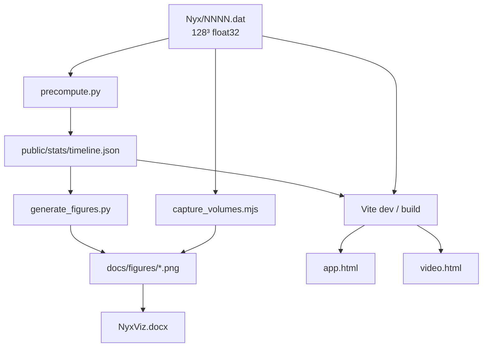
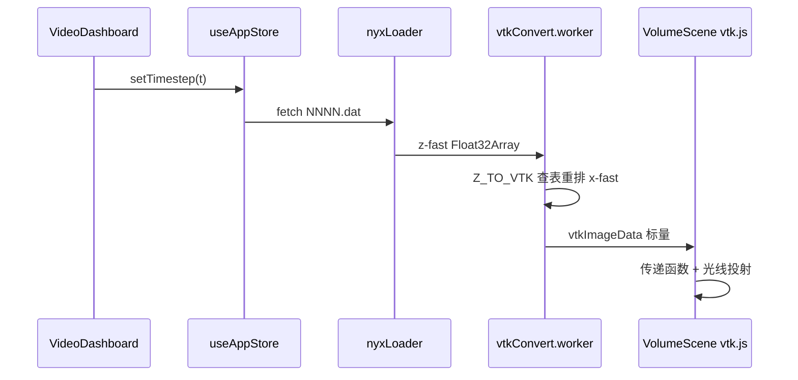

# 08 · 数据与代码管线

[← 07 文档地图](./07-仓库文档地图.md) · [← 主索引](../NyxViz_零基础完全解读.md)

---

## 端到端数据流

**原则**：网页 KPI、Word 表格、matplotlib 图 **共用 timeline.json**，避免数字不一致。

---

## 原始数据怎么读

| 项目 | 说明 |
|------|------|
| 路径 | `Nyx/0000.dat` … `0099.dat` |
| 大小 | 每文件 2,097,152 × 4 字节 |
| 字节序 | 小端 float32 (`<f4`) |
| 索引 | `i = z + 128*y + 128²*x`（**z-fast**） |

**加载**：

- Python：`np.fromfile` → `reshape(128,128,128, order='C')`  
- TS：[`nyxLoader.ts`](../../../src/data/nyxLoader.ts) → `flatIndex(x,y,z)`  
- 校验：[`verify_loader.py`](../../../tools/python/verify_loader.py)

---

## timeline.json 主要字段

每时间步 `timesteps["0"]` … `timesteps["99"]`：

| 字段 | 含义 |
|------|------|
| `mean`, `std` | 均值 σ |
| `p01`, `p50`, `p99`, `p999` | 分位数 |
| `skewness`, `excessKurtosis` | 偏度、超额峰度 |
| `moransI`, `xiR1`, `xiR10` | 空间统计 |
| `tailMassAboveP99`, `massFractionAboveP99` | Top 1% 体积/质量占比 |
| `voidFractionBelowT0P10`, `voidFractionBelowT0P01` | void 双阈值 |
| `histogram` | 128-bin 概率质量数组 |
| `histogramMeta` | 分箱边界、void 参考阈值说明 |

生成：[`precompute.py`](../../../tools/python/precompute.py)  
加载：[`statsLoader.ts`](../../../src/data/statsLoader.ts)

---

## 体渲染管线（浏览器）

| 模块 | 文件 | 职责 |
|------|------|------|
| TF / 色标 | `transferFunction.ts`, `colormap.ts` | cosmic 预设 |
| 相机 | `fitVolumeCamera.ts`, `renderSpec.ts` | 焦距、zoom、Phong |
| 渲染 | `VolumeScene.tsx` | vtk.js 体绘制 |
| 轴转换 | `vtkConvert.worker.ts` | z-fast → x-fast |
| 质量 | `adaptiveVolumeSampling.ts`, `volumeQualityCache.ts` | 采样步长、缓存 |

---

## 刷选与投影

| 模块 | 文件 |
|------|------|
| 刷选预设 | `brushPreset.ts`（top / filament / bottom） |
| 体素扫描 | `brushScan.worker.ts`, `brushScan.ts` |
| 2D 投影 | `projection.worker.ts`, `BandPreviewCanvas` |
| 直方图 brush | `DensityHistogram.tsx`, `HistogramOverlay.tsx` |
| 全局状态 | `useAppStore.ts`（timestep, brushRange） |
| 交互编排 | `useDashboardInteraction.ts` |

离线验证 JSON：`public/stats/brush_validation.json`（[`brush_analysis.py`](../../../tools/python/brush_analysis.py)）

---

## 录屏场景

| 想改… | 文件 |
|--------|------|
| 11 页布局、默认步、刷选预置 | `sceneRegistry.ts` |
| 旁白 UI 标签 | `narrationLabels.ts` |
| record 模式检测 | `useVideoScene.ts` |
| 录屏 CSS | `video-dashboard.css` |
| 分 scene 左中右内容 | `video-scenes/layout/Video*Column.tsx` |

---

## 配图与 Word

| 步骤 | 命令 / 脚本 |
|------|-------------|
| 预计算 | `npm run precompute` |
| 静态图 | `npm run figures` |
| 体渲染截图 | `npm run capture-volumes` |
| 报告 md | `npm run export-report` |
| Word | `npm run export-docx` ← `work_doc_content.py` |
| 一键打包 | `npm run submission-pack` |
| 全流程 | `npm run deliver` |

---

## 测试与校验

| 命令 | 作用 |
|------|------|
| `npm run test:report` | 报告数字 vs timeline |
| `npm run test:words` | 答卷每题 ≤800 字 |

---

[← 07 文档地图](./07-仓库文档地图.md) · [下一章：09 复现与答辩 →](./09-本地复现与答辩清单.md)
