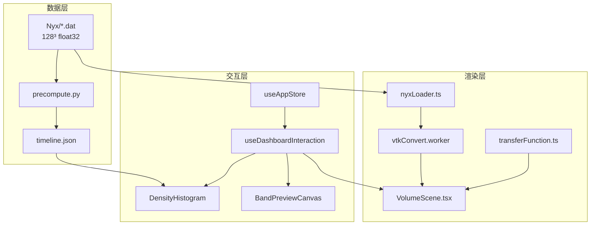

# 10 · 答辩代码讲解

[← 09 复现与答辩](./09-本地复现与答辩清单.md) · [← 主索引](../NyxViz_零基础完全解读.md)

---

## 本章是干什么的

[06 录屏手册](./06-录屏页video完全手册.md) 告诉你**指哪里、说什么**；[08 数据与代码管线](./08-数据与代码管线.md) 告诉你**打开哪个文件**。本章补上中间一层：**关键函数怎么串、答辩时怎么用白话讲实现**。

适合：答辩前 1 小时速读；评委追问「代码怎么做的」时对照。

**本章是总索引**；每个模块的**真实源码摘录**在下列子章（含 10–40 行可背诵代码块）：

| 子章 | 内容 | 文件数 |
|------|------|--------|
| [10a 体渲染与 VTK](./10a-体渲染与VTK代码.md) | nyxLoader → Worker → VolumeScene → TF | 18+ |
| [10b 直方图与 D3](./10b-直方图与D3代码.md) | DensityHistogram、brush、趋势图 | 8+ |
| [10c 刷选与 Worker](./10c-刷选与Worker代码.md) | store、useDashboardInteraction、三个 Worker | 10+ |
| [10d 投影与录屏 UI](./10d-投影空间与录屏组件代码.md) | Canvas 投影、video-scenes、长卷组件 | 50+ |
| [10e Python 配图](./10e-Python配图代码.md) | precompute、generate_figures、viz_style | 8+ |

---

## 三层架构（一张图记住）



**统一原则**：

1. **一个统计真源**：`public/stats/timeline.json` 驱动 Word 表格、matplotlib 配图、网页 KPI。
2. **一个全局 store**：`useAppStore` 存当前步、刷选区间、体数据；三栏组件只读/写 store，不各自维护副本。
3. **渲染与 KPI 分工**：体渲染/投影高亮按**密度阈值作用于全场**；右栏 KPI 计数在自定义框选时可能用**采样早停**（见下文任务四）。

---

## 1 · 全局联动（答辩必讲）

### 1.1 核心状态

[`useAppStore.ts`](../../../src/store/useAppStore.ts) 用 Zustand 管理全局状态：

| 字段 | 含义 | 典型写入方 | 典型读取方 |
|------|------|------------|------------|
| `timestep` | 当前时间步 0–99 | 顶栏滑条、演化缩略图 | 体渲染、直方图、`statsLoader` |
| `brushRange` | `{ min, max }` 密度区间 | D3 brush、预设按钮 | `VolumeScene`、`BandPreviewCanvas` |
| `brushedCount` | 刷选体素数（KPI 显示） | Worker 扫描 / 直方图估计 | 右栏体积占比 |
| `densityData` | 当前步 128³ 体素数组 | `nyxLoader` | Worker 扫描、投影 |
| `tfParams` | 透明度/增益微调 | 探索面板（app 长卷） | 传递函数 |

**源码（store 定义）** → 详见 [10c §useAppStore](./10c-刷选与Worker代码.md#useappstorets)：

```5:37:src/store/useAppStore.ts
interface AppState {
  timestep: number;
  densityData: Float32Array | null;
  loading: boolean;
  error: string | null;
  brushRange: BrushRange | null;
  brushedCount: number;
  tfParams: TfParams;
  setTimestep: (t: number) => void;
  setDensityData: (data: Float32Array | null) => void;
  setLoading: (v: boolean) => void;
  setError: (msg: string | null) => void;
  setBrushRange: (range: BrushRange | null) => void;
  setBrushedCount: (n: number) => void;
  setTfParams: (params: TfParams) => void;
}

export const useAppStore = create<AppState>((set) => ({
  timestep: 0,
  densityData: null,
  loading: false,
  error: null,
  brushRange: null,
  brushedCount: 0,
  tfParams: { opacityScale: 0.85, densityGain: -0.15, highlightBoost: 1.35 },
  setTimestep: (timestep) => set({ timestep }),
  setDensityData: (densityData) => set({ densityData }),
  setLoading: (loading) => set({ loading }),
  setError: (error) => set({ error }),
  setBrushRange: (brushRange) => set({ brushRange }),
  setBrushedCount: (brushedCount) => set({ brushedCount }),
  setTfParams: (tfParams) => set({ tfParams }),
}));
```

### 1.2 交互编排

[`useDashboardInteraction.ts`](../../../src/dashboard/useDashboardInteraction.ts) 是 app 与录屏页的**共用钩子**：

1. **换步**：`selectTimestep(t)` → `setTimestep` → 触发 `useNyxTimestep` 拉取对应 `.dat`。
2. **刷选**：`applyTop1` / `applyBottom1` / `applyFilament` → `setBrushRange`；或直方图 D3 brush 直接写 store。
3. **高亮**：`brushRange` 经 `useMemo` 转为 `highlightMin` / `highlightMax`，传给 `VolumeScene`。
4. **计数**：`brushRange` 变化后：
   - 若匹配预设（`matchBrushPreset`）→ 用 `timeline.json` 分位数**精确**算体素数；
   - 否则 → `scanBrushRangeAsync` 在 **Web Worker** 里 stride 采样，默认 `maxPoints=8000`。

录屏壳层 [`VideoDashboard.tsx`](../../../src/dashboard/VideoDashboard.tsx) 调用 `useDashboardInteraction(..., { videoMode: true })`，把返回的 `ix`（timestep、brush、highlight、预设回调等）分发给 [`VideoSceneLayout`](../../../src/dashboard/VideoSceneLayout.tsx) 左中右三栏。

**源码（预设刷选 + Worker 扫描 + highlight）** → [10c](./10c-刷选与Worker代码.md)：

```156:172:src/dashboard/useDashboardInteraction.ts
  const applyTop1 = useCallback(() => {
    if (!stats) return;
    setBrushRange({ min: stats.p99, max: stats.max });
    onPresetBrush?.();
  }, [stats, setBrushRange, onPresetBrush]);

  const applyBottom1 = useCallback(() => {
    if (!stats) return;
    setBrushRange({ min: stats.min, max: stats.p01 });
    onPresetBrush?.();
  }, [stats, setBrushRange, onPresetBrush]);

  const applyFilament = useCallback(() => {
    if (!stats) return;
    setBrushRange({ min: stats.p90, max: stats.p99 });
    onPresetBrush?.();
  }, [stats, setBrushRange, onPresetBrush]);
```

```203:243:src/dashboard/useDashboardInteraction.ts
    const preset = matchBrushPreset(stats, brushRange);
    const exactCount = preset ? exactPresetBrushCount(stats, preset) : null;
    if (exactCount != null) {
      setBrushedCount(exactCount);
      setScanning(false);
      prevBrushRef.current = { min: brushRange.min, max: brushRange.max };
      return;
    }
    // ... 自定义区间：延迟后 Worker 扫描
      scanBrushRangeAsync(densityData, brushRange.min, brushRange.max, 8000)
        .then((found) => {
          if (!cancelled) {
            setBrushedCount(found.length);
            setScanning(false);
          }
        })
  const highlight = useMemo(() => {
    if (!brushRange) return {};
    return { highlightMin: brushRange.min, highlightMax: brushRange.max };
  }, [brushRange]);
```

**源码（D3 brush → store）** → [10b](./10b-直方图与D3代码.md)：

```152:166:src/histogram/DensityHistogram.tsx
    const brush = d3
      .brushX()
      .extent([
        [0, 0],
        [innerW, innerH],
      ])
      .on('end', (event) => {
        if (!event.selection) return;
        const [x0, x1] = event.selection as [number, number];
        const min = x.invert(x0);
        const max = x.invert(x1);
        setBrushRange({ min: Math.min(min, max), max: Math.max(min, max) });
      });

    g.append('g').attr('class', 'brush').call(brush);
```

### 1.3 口述模板（约 30 秒）

> 我们把当前时间步和刷选区间放在全局 store 里。用户点 Top 1% 或拖拽直方图后，`brushRange` 同步传给 vtk.js 体渲染和 XY 投影，两边用同一密度阈值高亮。KPI 数字对预设刷选用预计算分位数精确计数；宽区间拖拽为了流畅会在 Worker 里采样，但 3D 高亮仍对全场 128³ 网格生效。

### 1.4 若评委追问

| 问题 | 答法要点 |
|------|----------|
| 为什么用 Zustand 不用 Redux？ | 轻量全局状态；app 与录屏共用同一 store 模式。 |
| 三栏怎么同步？ | 不组件间传参链，统一读 `useAppStore` + `useDashboardInteraction` 出口。 |
| 换步会不会丢刷选？ | 每步 `stats` 含该步 p99 等；预设按当前步分位数重算区间。 |

---

## 2 · 任务一：体渲染与密度演化

### 答辩目标

说明如何用 **vtk.js GPU 光线投射** 在浏览器里看见 void—filament—node，以及**五帧条带图与交互演示的 TF 差异**。

### 文件链

```
Nyx/NNNN.dat
  → nyxLoader.ts（fetch + flatIndex z-fast）
  → vtkConvert.worker.ts（重排为 vtk x-fast）
  → VolumeScene.tsx（vtkImageData + 光线投射）
  → transferFunction.ts + tfDomain.ts（cosmic 色标与 Phong）
```

→ **完整源码**：[10a 体渲染与 VTK](./10a-体渲染与VTK代码.md)

静态条带：`tools/node/capture_volumes.mjs` → `docs/figures/task1_vol_*.png` → [`generate_figures.py`](../../../tools/python/generate_figures.py) 拼 `task1_vol_strip.png`。

### 关键函数

| 函数 / 模块 | 文件 | 做什么 |
|-------------|------|--------|
| `flatIndex(x,y,z)` | `nyxLoader.ts` | 赛题 z-fast 索引：`z + 128*y + 128²*x` |
| `prewarmVtkScalarsQuiet` | `vtkConvert.ts` | 主线程调度 Worker 做轴重排 |
| `buildTransferFunction` | `transferFunction.ts` | log 域 RGB/α 控制点 + 刷选高亮 boost |
| `getGlobalTfDomain` | `tfDomain.ts` | 交互页**固定**全域 p01–p99 |
| Evolution Profile | `capture/main.tsx` | **仅截图**：每帧 TF 随步变化 |

相机与光照参数来自 [`render_spec.json`](../../../public/stats/render_spec.json)（Python `render_spec.py` 导出），`VolumeScene` 读取后设置 `cameraZoom`、Phong 系数。

### 答辩 30 秒

> 任务一用 vtk.js 对 128³ 密度场做体绘制。数据按赛题 z-fast 顺序读入，在独立 Worker 里转成 vtk 需要的布局，避免主线程卡顿。传递函数在 log 域用全域 p01–p99 压缩动态范围，配合 Phong 光照让 void 与 filament 同屏可辨。Word 里的五帧条带是截图专用参数，只讲形态；答辩演示以交互系统全局 TF 为准。

### 若评委追问

| 问题 | 答法 |
|------|------|
| 为什么不用 matplotlib 画 3D？ | 赛题要交互联动；vtk.js 走 GPU，可与刷选、时间轴实时同步。 |
| 条带和网页颜色为何不同？ | 条带每帧 Evolution Profile；网页 `getGlobalTfDomain` 不变。见 [00 章三种方式](./00-阅读指南.md#三种看宇宙网的方式别混了)。 |
| Worker 做什么？ | z-fast → x-fast 重排 + 可选预暖；百万体素转换不阻塞 UI。 |

---

## 3 · 任务二：宇宙密度演化规律

### 答辩目标

说明 **σ +15.4%、p99−p01 +15.1%** 等数字如何从百步体数据算出，并进入网页 KPI 与 Word 曲线。

### 文件链

```
Nyx/*.dat
  → precompute.py（逐步行统计 + 直方图分箱 + 空间指标）
  → public/stats/timeline.json
  → statsLoader.ts / storyMetrics.ts
  → PosterTrendChart.tsx、VideoKpiStrip、发现卡
```

静态图：`generate_figures.py` → `task2_evolution_story.png`；空间统计辅助 [`validation_suite.py`](../../../tools/python/validation_suite.py)。

→ **完整源码**：[10e Python 配图](./10e-Python配图代码.md) · KPI 组件见 [10d](./10d-投影空间与录屏组件代码.md)

### 关键函数

| 函数 | 文件 | 做什么 |
|------|------|--------|
| `load_volume` | `precompute.py` | `np.fromfile` + reshape(128,128,128) |
| `computeStoryMetrics` | `storyMetrics.ts` | 从 timeline 算 σ%、span%、尾段体积/质量占比 |
| `getTimestepStats` | `statsLoader.ts` | 按 `timestep` 取单步 `mean/std/p99/...` |

**void 扩张**：采用 **t=0 固定的 p10 阈值** 统计低于该密度的体积分数跨步变化（非每步重算 p10），保证跨步可比——与 Word §3 叙述一致。

Moran's I、ξ(r) 等写在 `timeline.json`，bootstrap 在 `validation_suite.py`；正文作辅证，主证仍是 σ 与分位跨度曲线。

### 答辩 30 秒

> 任务二不手填表格数字。Python 预计算脚本遍历 100 步体数据，把均值、标准差、分位数、尾段质量占比写入 timeline.json。前端只读 JSON 画 KPI 和趋势图，与 Word、matplotlib 配图共用同一文件，保证报告和演示一致。

### 若评委追问

| 问题 | 答法 |
|------|------|
| 数字存在哪？ | `public/stats/timeline.json`；改数据后 `npm run precompute`。 |
| Moran's I 能证明团块化吗？ | 描述性辅证；bootstrap 未达 2σ，主证看 σ 与 p99−p01 百步曲线。 |
| void 怎么定义？ | 固定 t=0 的 p10 密度以下为 void 区，看体积分数 10%→24.69%。 |

---

## 4 · 任务三：时序密度直方图

### 答辩目标

说明 **128 bins、log 轴、Probability mass×100** 如何实现，以及为何不在浏览器里现场重算百万体素直方图。

### 文件链

```
precompute.py → timeline.json
  ├─ timesteps[t].histogram（128-bin 概率质量）
  ├─ logBinEdges
  └─ histogramMeta
  → DensityHistogram.tsx（D3 绘制 + brush 交互）
  → HistogramOverlay.tsx（多步叠加，录屏/探索）
```

静态五步叠加：[`generate_figures.py`](../../../tools/python/generate_figures.py) `task3_story_panel.png`、`task3_hist_overlay.png`。

→ **完整源码**：[10b 直方图与 D3](./10b-直方图与D3代码.md) · Python 分箱见 [10e](./10e-Python配图代码.md)

### 关键函数

| 函数 | 文件 | 做什么 |
|------|------|--------|
| 直方图分箱 | `precompute.py` | log 等距 128 bins，每步 N=2,097,152 |
| `DensityHistogram` | `DensityHistogram.tsx` | D3 scaleLog 横轴；brush 写 `setBrushRange` |
| `estimateBrushCountFromHistogram` | `brushEstimate.ts` | 无体数据时用分箱质量估计 KPI（静态图模式） |

纵轴 **Probability mass×100** = 该 bin 体素数 / 总体系素 × 100，与 Word 表述一致。

### 答辩 30 秒

> 任务三的直方图在预计算阶段就对每步 128³ 场做了 log 域 128 分箱，结果存在 timeline.json。网页用 D3 画分布并支持 brush 框选，换步只换数组不重算直方图，保证录屏时 60fps 交互。多步叠加的静态图由 Python 脚本合成，用于 Word 插图。

### 若评委追问

| 问题 | 答法 |
|------|------|
| 为什么 128 bins？ | 精度与平滑折中；附录 5.3 对比 64/128/256，结论不变。 |
| 直方图能刷选吗？ | 能；brush 事件写入全局 store，联动体渲染（任务四）。 |
| 锯齿从哪来？ | log 域宽动态范围 + 多峰结构；非 bug。 |

---

## 5 · 任务四：相空间刷选与空间验证

### 答辩目标

说明 **统计→空间→统计** 闭环的实现，以及离线 **召回 100%、精确率 27.6%** 的含义。

### 文件链

```
brushPreset.ts（Top 1% / 纤维带 / Bottom 1% 区间）
  → useAppStore.brushRange
  ├→ VolumeScene（highlightMin/Max 改传递函数）
  ├→ BandPreviewCanvas + projection.worker（XY 最大密度投影金斑）
  └→ brushScan.worker（自定义区间 KPI 采样）

离线：brush_analysis.py → brush_validation.json → 录屏 validate 场景 KPI
```

→ **完整源码**：[10c 刷选与 Worker](./10c-刷选与Worker代码.md) · 投影/录屏 UI 见 [10d](./10d-投影空间与录屏组件代码.md)

录屏布局：task4-brush → [`VideoRightColumn.tsx`](../../../src/dashboard/video-scenes/layout/VideoRightColumn.tsx)；task4-validate → [`VideoValidateFigureColumn.tsx`](../../../src/dashboard/video-scenes/VideoValidateFigureColumn.tsx)。

### 关键函数

| 函数 | 文件 | 做什么 |
|------|------|--------|
| `matchBrushPreset` | `brushPreset.ts` | 判断当前 brush 是否等于 top/filament/bottom |
| `scanBrushRangeAsync` | `brushScan.ts` | Worker 内 stride 扫描，返回最多 maxPoints 个体素 |
| `buildTransferFunction` | `transferFunction.ts` | 刷选区间内提高 α/亮度 |
| `export_brush_validation` | `brush_analysis.py` | 阈值表、早停耗时、召回/精确率 |

**重要区分**：

- **体渲染 / 投影高亮**：按 `brushRange` 密度阈值作用于**全场** 2,097,152 体素。
- **右栏 KPI 数字**：自定义宽区间时 Worker **采样**（stride=2, maxPoints=8000），显示数可远低于真值（附录表17）；Top 1% 早停约 12.7% 显示比例。

离线 **精确率 27.6%** = 密度 Top 1% 集合中，仅 27.6% 同时落在 filament **几何代理**上；**召回 100%** = 所有脊线体素都被 Top 1% 密度集合覆盖——说明「分位集合 ⊃ 脊线」，不是刷选错误。

### 答辩 30 秒

> 任务四用 D3 直方图和预设按钮选定密度区间，经全局 store 同步到 vtk 体渲染和 Canvas 投影，完成统计到空间的联动。离线脚本用 filament 亮脊作几何代理，与 Top 1% 密度集合对比，得到召回 100%、精确率 27.6%，说明我们先按统计选尾段再看形态是合理设计。性能上 Worker 早停约 45ms，全网格约 352ms。

### 若评委追问

| 问题 | 答法 |
|------|------|
| KPI 很小是不是错了？ | 采样 KPI 与全场高亮是两套机制；见 [09 FAQ Q4](./09-本地复现与答辩清单.md)。 |
| 精确率低是不是失败？ | 否；密度分位集合故意比脊线更宽，召回满即证明 Top 1% 覆盖所有 filament 代理。 |
| P88 反查是什么？ | 从亮脊投影反查密度带 ρ∈[11.23, 12.16]，与 Top 1% 相容；Python `spatial_to_stats` 生成静态图。 |

---

## 6 · 录屏 11 段 → 代码速查

与 [06 章](./06-录屏页video完全手册.md) 对照使用：06 讲操作，下表讲**实现入口**。

| 段 | scene | 答辩若问「这段怎么实现的」 | 优先打开 |
|----|-------|---------------------------|----------|
| 1 | intro | 三栏布局、发现区 | `VideoSceneLayout.tsx`, `sceneRegistry.ts` → [10d](./10d-投影空间与录屏组件代码.md) |
| 2 | task1-tf | 传递函数与光照示意 | `VideoRenderSpecPanel.tsx`, `transferFunction.ts` → [10a](./10a-体渲染与VTK代码.md) |
| 3 | task1-morph | 五帧切步 | `EvolutionThumbnails.tsx`, `useNyxTimestep.ts` → [10d](./10d-投影空间与录屏组件代码.md) |
| 4 | task2-evolution | KPI 与四联图 | `VideoEvolutionFigurePanel.tsx`, `storyMetrics.ts` → [10d](./10d-投影空间与录屏组件代码.md) |
| 5 | task2-void | void 双阈值卡 | `VideoVoidScene.tsx`, `timeline.json` void 字段 → [10d](./10d-投影空间与录屏组件代码.md) |
| 6 | task2-cases | 案例 A/B/C | `VideoCaseCards.tsx` → [10d](./10d-投影空间与录屏组件代码.md) |
| 7 | task2-spatial | Moran / ξ 四宫格 | `VideoSpatialPanel.tsx` → [10d](./10d-投影空间与录屏组件代码.md) |
| 8 | task3-hist | 直方图与叠加 | `DensityHistogram.tsx`, `HistogramOverlay.tsx` → [10b](./10b-直方图与D3代码.md) |
| 9 | task4-brush | 刷选联动 | `useDashboardInteraction.ts`, `VideoRightColumn.tsx` → [10c](./10c-刷选与Worker代码.md) |
| 10 | task4-validate | 离线验证 KPI | `brush_validation.json`, `brush_analysis.py` → [10e](./10e-Python配图代码.md) |
| 11 | findings | 四发现卡 | `VideoFindingsStrip.tsx`, `storyMetrics.ts` → [10d](./10d-投影空间与录屏组件代码.md) |

场景元数据（默认步、刷选预设、布局 class）集中在 [`sceneRegistry.ts`](../../../src/video/sceneRegistry.ts)；录屏模式由 [`useVideoScene.ts`](../../../src/video/useVideoScene.ts) 解析 URL 参数。

---

## 7 · 代码类评委 FAQ

科学结论类问答见 [09 章](./09-本地复现与答辩清单.md)；此处仅列**实现类**。

### Q1：`timeline.json` 谁生成？多久更新一次？

运行 `npm run precompute`（或 `python run.py` 首次启动时自动）。原始 `Nyx/*.dat` 不变则 JSON 不变；改数据或分箱逻辑后需重跑。

### Q2：配图和网页数字会不一致吗？

设计上不会：共用 `timeline.json`。自检：`npm run test:report`。

### Q3：代表图怎么生成？

PIL 四幕叙事海报：`npm run capture-app-poster` → [`compose_representative_poster.py`](../../../tools/python/compose_representative_poster.py)。详见 [05 章](./05-交互页app说明.md#代表图怎么来的)。

### Q4：为什么 KPI 和体渲染高亮范围「看起来」不一致？

高亮对**全场**按阈值着色；KPI 在自定义拖拽时用 Worker **采样计数**。宽区间显示可仅 ~0.78% 真值，高亮仍正确。

### Q5：Web Worker 有哪些？

| Worker | 作用 |
|--------|------|
| `vtkConvert.worker` | 体素轴重排 → vtkImageData |
| `brushScan.worker` | 刷选体素扫描（早停） |
| `projection.worker` | XY 最大密度投影 |

### Q6：静态图和在线演示分工？

| 类型 | 生成 | 用途 |
|------|------|------|
| matplotlib/PIL 拼接图 | `generate_figures.py` | Word 插图 |
| Playwright 体渲染截图 | `capture_volumes.mjs` | 五帧条带 |
| 浏览器实时 | vtk.js + D3 | 答辩演示、录屏 |

### Q7：想改录屏某页默认刷选？

改 [`sceneRegistry.ts`](../../../src/video/sceneRegistry.ts) 对应 scene 的 `brushPreset` / `defaultTimestep`。

### Q8：想改旁白 UI 上的标签？

改 [`narrationLabels.ts`](../../../src/video/narrationLabels.ts)，与 [`VIDEO_NARRATION_TTS.txt`](../../competition/VIDEO_NARRATION_TTS.txt) 对齐。

---

## 推荐阅读顺序（答辩前 1 小时）

1. [03 叙事逻辑](./03-叙事逻辑与科学结论.md) — 讲什么结论  
2. **本章 §1 全局联动** — 讲怎么实现  
3. 按评委可能问的任务读 **§2–§5** 对应节  
4. [06 录屏手册](./06-录屏页video完全手册.md) — 指屏 rehearsal  
5. [09 FAQ](./09-本地复现与答辩清单.md) — 科学类追问  

---

## 8 · 可视化源码文件清单（全覆盖）

下列文件均在子章中有**真实源码摘录**；答辩前可按任务勾选。

### 10a 体渲染与 VTK

- [x] `src/data/nyxLoader.ts`
- [x] `src/data/vtkLayout.ts`
- [x] `src/data/vtkConvert.ts`
- [x] `src/workers/vtkConvert.worker.ts`
- [x] `src/viz/colormap.ts`
- [x] `src/viz/tfDomain.ts`
- [x] `src/volume/transferFunction.ts`
- [x] `src/volume/renderSpec.ts`
- [x] `src/volume/VolumeScene.tsx`
- [x] `src/volume/adaptiveVolumeSampling.ts`
- [x] `src/volume/volumeQualityCache.ts`
- [x] `src/volume/fitVolumeCamera.ts`
- [x] `src/volume/volumeCameraFly.ts`
- [x] `src/volume/volumeFocusPick.ts`
- [x] `src/volume/DensityColorLegend.tsx`
- [x] `src/volume/TransferFunctionControls.tsx`
- [x] `src/dashboard/PosterHeroVolume.tsx`
- [x] `src/capture/main.tsx`

### 10b 直方图与 D3

- [x] `src/data/statsLoader.ts`
- [x] `src/histogram/chartTheme.ts`
- [x] `src/hooks/useChartSize.ts`
- [x] `src/histogram/DensityHistogram.tsx`
- [x] `src/histogram/HistogramOverlay.tsx`
- [x] `src/histogram/BrushHistogramPreview.tsx`
- [x] `src/histogram/TimelineMetrics.tsx`
- [x] `src/dashboard/PosterTrendChart.tsx`

### 10c 刷选与 Worker

- [x] `src/store/useAppStore.ts`
- [x] `src/data/brushPreset.ts`
- [x] `src/data/brushScan.ts`
- [x] `src/data/brushEstimate.ts`
- [x] `src/dashboard/useDashboardInteraction.ts`
- [x] `src/workers/brushScan.worker.ts`
- [x] `src/data/projectionAsync.ts`
- [x] `src/workers/projection.worker.ts`

### 10d 投影与录屏 UI

- [x] `src/spatial/BandPreviewCanvas.tsx`
- [x] `src/spatial/BrushedPoints.tsx`
- [x] `src/spatial/TriaxialSlices.tsx`
- [x] `src/spatial/DensityProjection.tsx`
- [x] `src/hooks/useSharedProjection.ts`
- [x] `src/dashboard/VideoDashboard.tsx` · `VideoSceneLayout.tsx` · `VideoApp.tsx`
- [x] `src/dashboard/video-scenes/layout/*`（6 文件）
- [x] `src/dashboard/video-scenes/*`（全部 scene 组件）
- [x] `src/video/sceneRegistry.ts` · `useVideoScene.ts` · `narrationLabels.ts`
- [x] `src/components/StarfieldBackground.tsx` · `ImageLightbox.tsx`
- [x] 长卷 viz：`StoryKpiStrip`、`EvolutionThumbnails`、`DiscoveryCards` 等（见 [10d](./10d-投影空间与录屏组件代码.md)）

### 10e Python 配图

- [x] `tools/python/precompute.py`
- [x] `tools/python/spatial_to_stats.py`
- [x] `tools/python/brush_analysis.py`
- [x] `tools/python/render_spec.py`
- [x] `tools/python/projection_render.py`
- [x] `tools/python/viz_style.py`
- [x] `tools/python/generate_figures.py`（关键函数分节）
- [x] `tools/python/compose_representative_poster.py`

重新生成子章源码块：`python tools/python/build_code_guide.py`

---

[← 09 复现与答辩](./09-本地复现与答辩清单.md) · [← 主索引](../NyxViz_零基础完全解读.md)
